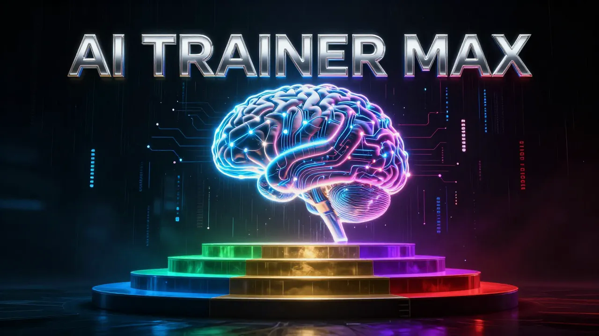
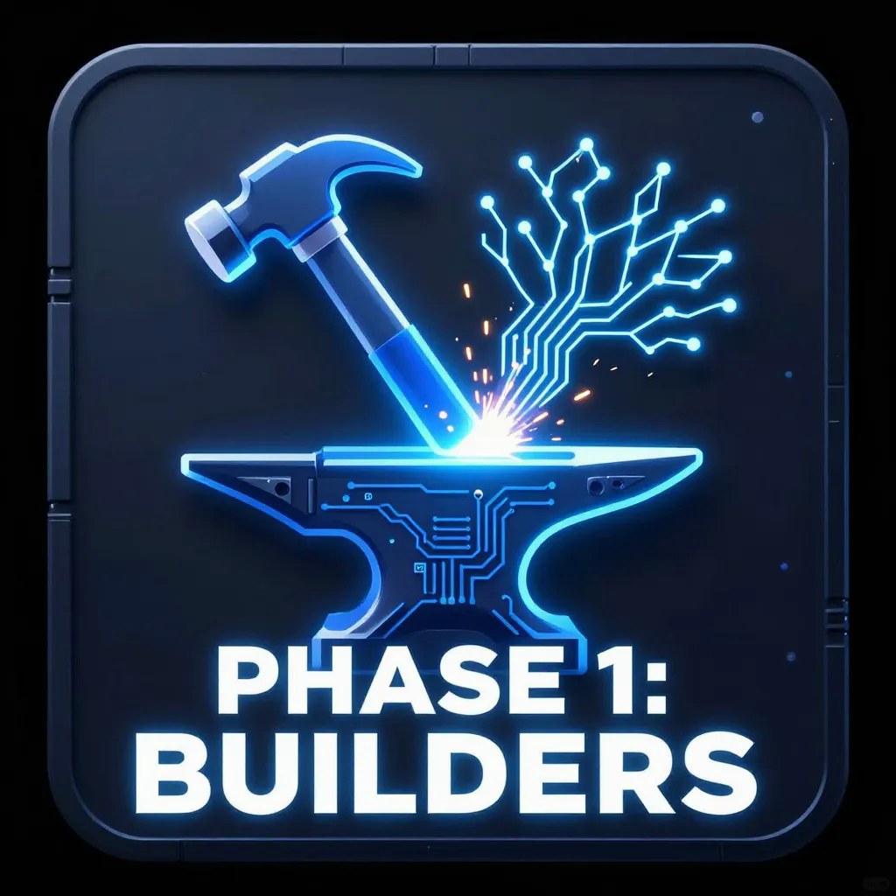
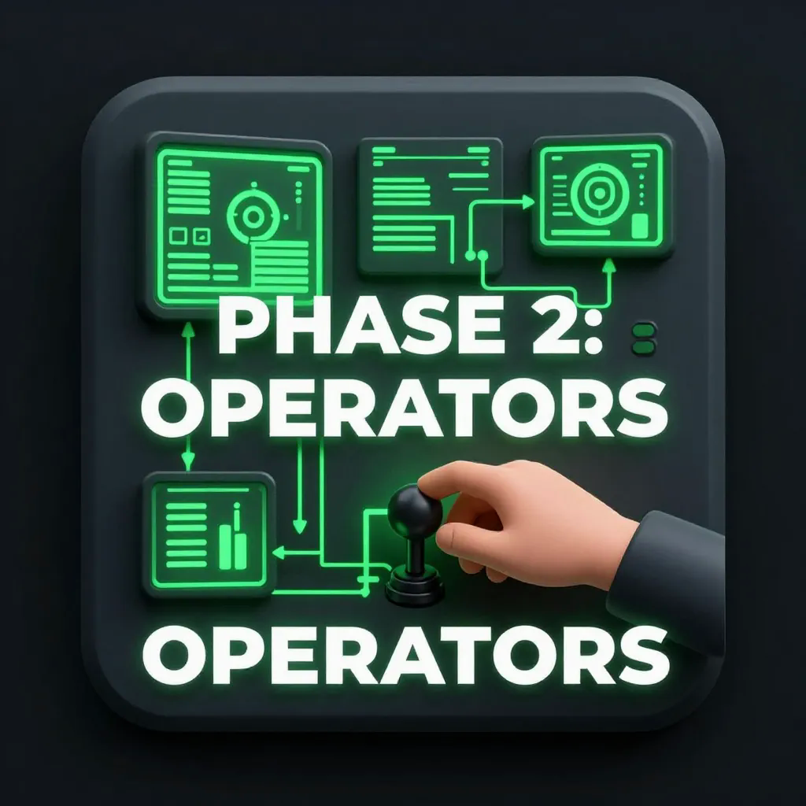
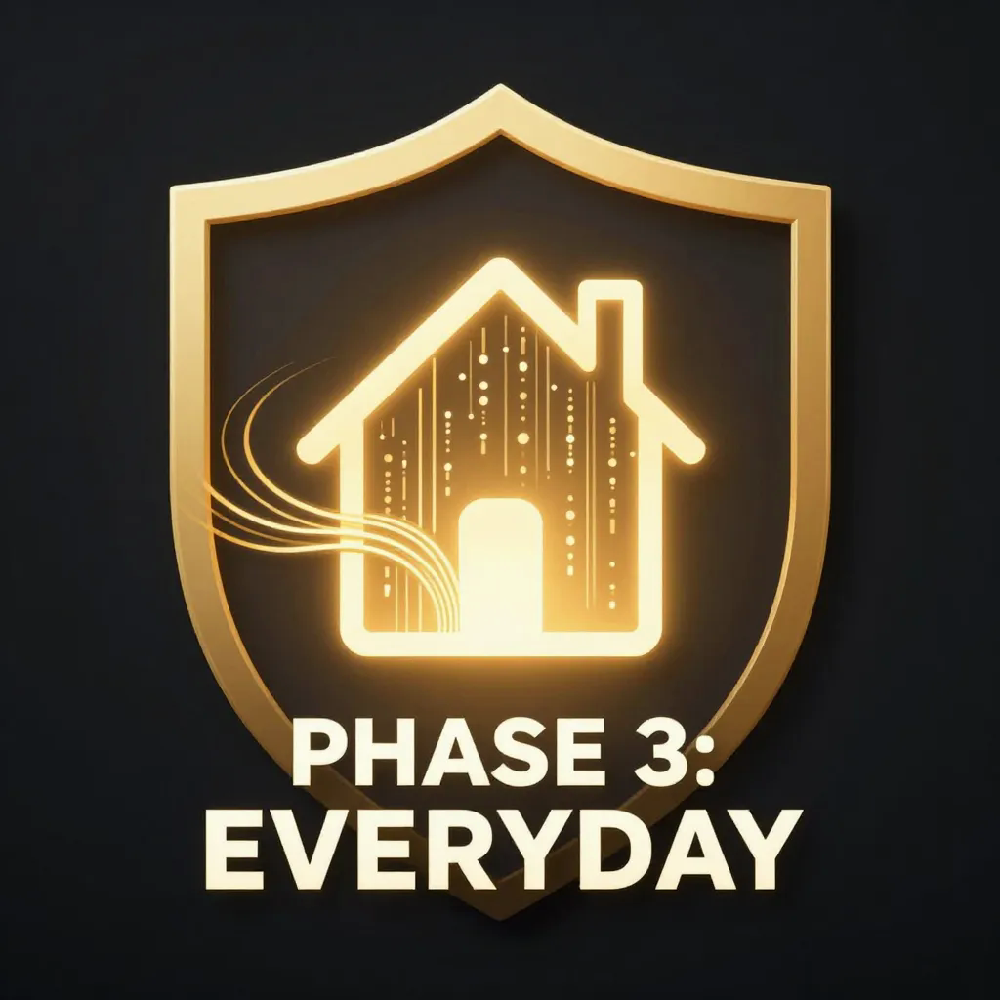
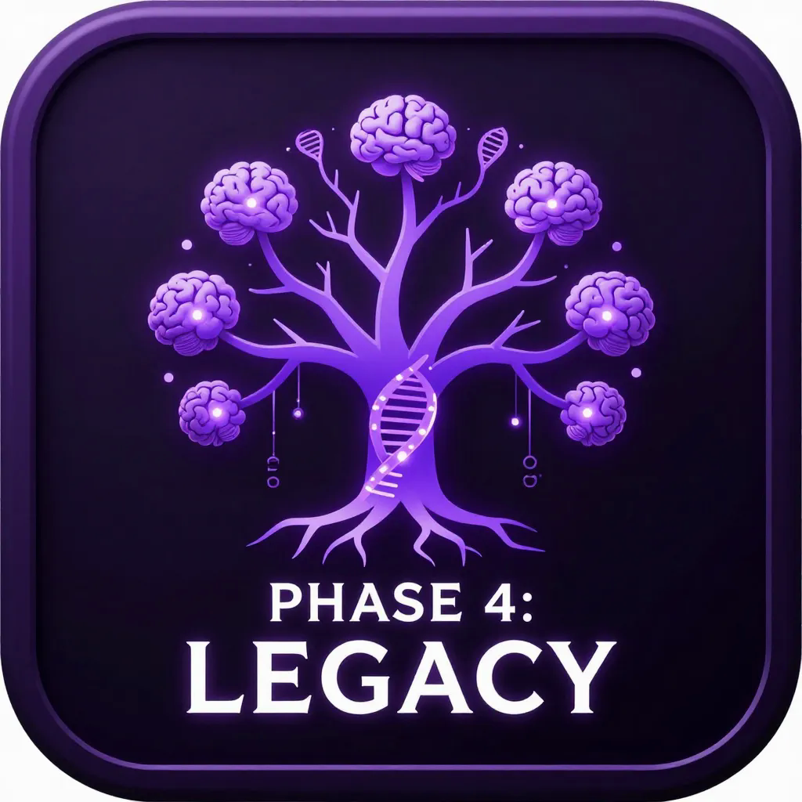
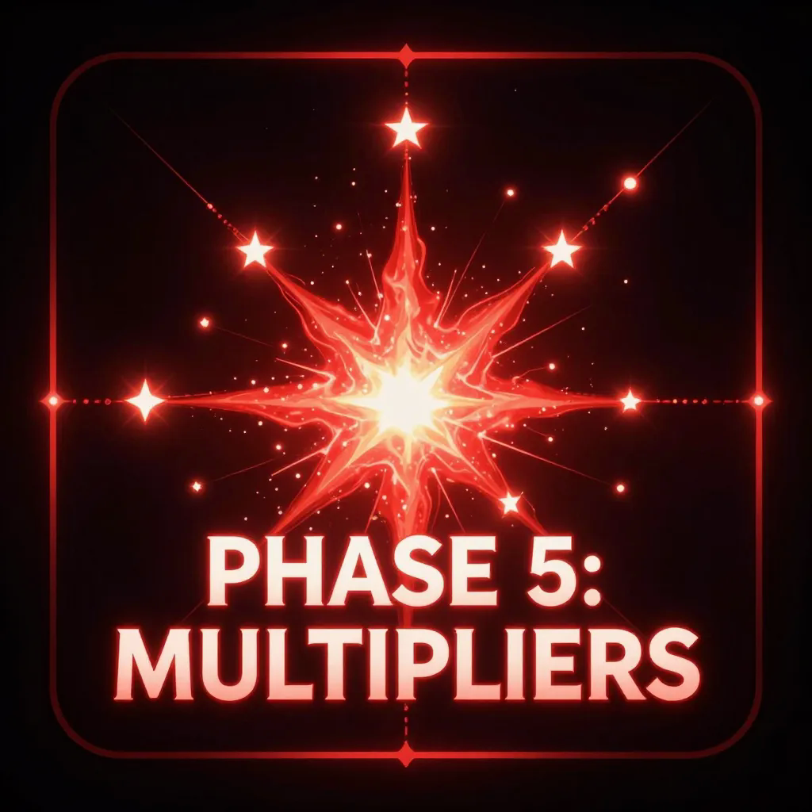

<div align="center">


# Angel Cloud AI Training Tools (ACATT)

> **Try Claude free for 2 weeks** — the AI behind this entire ecosystem. [Start your free trial →](https://claude.ai/referral/4fAMYN9Ing)

---


**Local AI literacy for every person. No cloud. No subscription. No permission needed.**

[](https://github.com/thebardchat/constitution)
[](https://github.com/sponsors/thebardchat)
[](https://www.amazon.com/Probably-Think-This-Book-About/dp/B0GT25R5FD)
[](https://huggingface.co/thebardchat)
[](https://github.com/thebardchat/AI-Trainer-MAX)
[](https://github.com/thebardchat/AI-Trainer-MAX)
[](https://opensource.org/licenses/MIT)
[](https://github.com/thebardchat/AI-Trainer-MAX)
[](https://github.com/thebardchat/AI-Trainer-OBLIVION)
[](https://github.com/thebardchat/AI-Trainer-MAX)
[](https://github.com/thebardchat/AI-Trainer-MAX)

*"Your legacy runs local."*

</div>

---

## What Is This?

A modular, CLI-based training system that teaches people how to build, run, and own local AI — starting from zero. 36 modules across 5 phases take you from installing your first model to building a personal AI brain you can pass down to your family.

Every module runs on Windows .bat scripts, respects a 7.4GB RAM ceiling, and requires zero cloud accounts.

This is the training layer of the Angel Cloud ecosystem.

## Why?

800 million Windows users are about to lose security update support. Most of them have never touched AI. This project exists to give them the skills to run AI on their own hardware before that window closes.

We believe AI literacy is a right, not a subscription.

## Quick Start

**Windows:**
1. Install Ollama: https://ollama.com
2. Install Docker Desktop (for Weaviate + MCP server)
3. Open a terminal in this folder
4. Run: `launch-training.bat`
5. Start with Module 1.1

**Linux / Raspberry Pi:**
1. Install Ollama: https://ollama.com
2. Start Docker services (Weaviate + MCP server)
3. Open a terminal in this folder
4. Run: `bash launch-training.sh`
5. Start with Module 1.1

The launcher handles health checks, progress tracking, and module navigation.

## Phase Roadmap

All 5 phases are complete and shipped. 36 modules. Zero to AI sovereignty.

<table>
  <tr>
    <td align="center" width="20%">
      <br/>
      <b>Phase 1: BUILDERS</b><br/>
      <sub>5 modules</sub><br/>
      <sub>Developers, self-learners</sub><br/>
      <sub><i>Local AI with Ollama + RAG</i></sub>
    </td>
    <td align="center" width="20%">
      <br/>
      <b>Phase 2: OPERATORS</b><br/>
      <sub>7 modules</sub><br/>
      <sub>Business owners, dispatchers</sub><br/>
      <sub><i>Business automation</i></sub>
    </td>
    <td align="center" width="20%">
      <br/>
      <b>Phase 3: EVERYDAY</b><br/>
      <sub>7 modules</sub><br/>
      <sub>Non-technical Windows users</sub><br/>
      <sub><i>MCP-powered personal AI tools</i></sub>
    </td>
    <td align="center" width="20%">
      <br/>
      <b>Phase 4: LEGACY</b><br/>
      <sub>7 modules</sub><br/>
      <sub>Families, next generation</sub><br/>
      <sub><i>YourNameBrain digital inheritance</i></sub>
    </td>
    <td align="center" width="20%">
      <br/>
      <b>Phase 5: MULTIPLIERS</b><br/>
      <sub>10 modules</sub><br/>
      <sub>Phase 1-4 graduates</sub><br/>
      <sub><i>Defend, teach, connect, build deeper</i></sub>
    </td>
  </tr>
</table>

## Architecture

```
AI-Trainer-MAX/
├── launch-training.bat              # Windows entry point — start here
├── launch-training.sh               # Linux/Pi entry point
├── run-module.sh                    # Linux .bat compatibility layer
├── config.json                      # Module registry + metadata
├── phases/
│   ├── phase-1-builders/            # 5 modules — Ollama, vectors, RAG, prompts, packaging
│   ├── phase-2-operators/           # 7 modules — Business brain, Q&A, drafts, workflows
│   ├── phase-3-everyday/            # 7 modules — Vault, chat, drafting, security, briefings
│   ├── phase-4-legacy/              # 7 modules — YourNameBrain, journaling, storytelling
│   └── phase-5-multipliers/         # 10 modules — Hardening, teaching, export, protocol
├── progress/
│   └── user-progress.json           # Auto-tracked completion data
└── shared/
    ├── ascii-art/                   # CLI branding assets
    └── utils/
        ├── health-check.bat         # Windows: Ollama + Weaviate health check
        ├── health-check.sh          # Linux/Pi: Ollama + Weaviate + MCP health check
        ├── mcp-call.py              # MCP client helper (stdlib only)
        └── mcp-health-check.bat     # MCP server health check (Windows)
```

## Module Flow

Every module follows the same pattern:

```
LESSON → EXERCISE → VERIFY → NEXT
```

- **lesson.md** — What you need to know (starts with WHAT YOU'LL BUILD, ends with WHAT YOU PROVED)
- **exercise.bat** — Hands-on tasks (guided, under 15 minutes)
- **verify.bat** — Automated pass/fail checks with specific failure reasons
- **hints.md** — Progressive hints if you get stuck (3 levels)

## Tech Stack

- **LLM Runtime:** Ollama (localhost:11434)
- **Default Model:** llama3.2:1b (Phase 1-2), shanebrain-3b (Phase 3-5)
- **Vector DB:** Weaviate (localhost:8080)
- **MCP Server:** ShaneBrain MCP (localhost:8100) — 42 tools via Model Context Protocol
- **Scripting:** Windows .bat (CMD compatible)
- **Content Format:** Markdown
- **JSON Handling:** Python stdlib only — zero pip installs
- **Dependencies:** curl (built into Windows 10+), Python 3.x in PATH

## Infrastructure

All `thebardchat` repos run on the same physical hardware stack.

| Hardware | Role |
|----------|------|
| **Raspberry Pi 5 (16GB RAM)** | Local AI inference node — the brain |
| **Pironman 5-MAX by Sunfounder** | NVMe RAID chassis — the spine |
| **2x WD Blue SN5000 2TB NVMe** | RAID 1 via mdadm — the memory |

Core services path: `/mnt/shanebrain-raid/shanebrain-core/`

## Requirements

- Windows 10 or 11
- 7.4GB RAM minimum (4GB+ free recommended)
- Ollama installed
- Docker Desktop (for Weaviate + MCP server)
- Python 3.x in PATH
- curl (included in Windows 10+)

## MCP Server (Phase 3-5)

Phases 3-5 use the ShaneBrain MCP server for 19 AI tools:

| Category | Tools |
|----------|-------|
| Knowledge | `search_knowledge`, `add_knowledge`, `chat_with_shanebrain` |
| Vault | `vault_add`, `vault_search`, `vault_list_categories` |
| Notes | `daily_note_add`, `daily_note_search`, `daily_briefing` |
| Drafting | `draft_create`, `draft_search` |
| Security | `security_log_search`, `privacy_audit_search` |
| Social | `search_friends`, `get_top_friends` |
| System | `system_health` |

The MCP server runs in Docker alongside Weaviate. See the [shanebrain-core](https://github.com/thebardchat/shanebrain-core) repo for server setup.

## Contributing

This is a family-driven project, but contributions are welcome.

**Ground rules:**
- Every script must run on Windows .bat (no PowerShell-only unless fallback provided)
- No cloud dependencies in Phase 1
- Peak memory per module: 3GB (reserve the rest for Ollama + Weaviate)
- Lesson tone: direct, encouraging, zero fluff, Grade 8-10 reading level
- Every lesson starts with "WHAT YOU'LL BUILD" and ends with "WHAT YOU PROVED"
- Banned words: "streamline", "revolutionary", "in today's rapidly evolving landscape"

**To add a module:**
1. Create a folder under the appropriate phase: `module-X.X-short-name/`
2. Include all 4 files: lesson.md, exercise.bat, verify.bat, hints.md
3. Register it in config.json
4. Add it to launch-training.bat menu
5. Test on a machine with 4GB free RAM

## The Ecosystem

```
ShaneBrain (Pi 5 · local AI · private)
  └── Angel Cloud (VPS · public platform · families)
        └── Pulsar AI (enterprise · secure · post-quantum)
              └── TheirNameBrain (personalized · legacy AI · generational)
                    └── ~800M users losing Windows 10 support
```

## The Mission

This project is part of Angel Cloud — a faith-rooted, family-driven AI platform built on the belief that every person deserves access to AI literacy and local AI sovereignty.

Built in Alabama. Built for everyone.

## Support This Work

If what I'm building matters to you -- local AI for real people, tools for the left-behind -- here's how to help:

- **[Sponsor me on GitHub](https://github.com/sponsors/thebardchat)**
- **[Buy the book](https://www.amazon.com/Probably-Think-This-Book-About/dp/B0GT25R5FD)** -- *You Probably Think This Book Is About You*
- **Star the repos** -- visibility matters for projects like this

---
 
## What's next — for graduates
 
You finished all 5 phases of MAX. You own your local AI. You shipped your digital legacy.
 
Now the training wheels come off.
 
### → [AI-Trainer-OBLIVION](https://github.com/thebardchat/AI-Trainer-OBLIVION)
 
*"For the graduates. Bring a bigger machine."*
 
The research-math layer MAX deliberately left out. Fine-tuning on your own hardware. LoRA / QLoRA on consumer GPUs. Quantization trade-offs. Custom Modelfiles at depth. Training-data curation. Eval harnesses. Embedding-space geometry. Running your fine-tune in production.
 
**Gate-kept on purpose.** No release date. Shipped when it's ready, not before.
 
⭐ Star the repo to signal interest and get notified when alpha modules drop.
 
---

## Built With

<table>
  <tr>
    <td align="center" width="200">
      <b>Claude by Anthropic</b><br/>
      <sub>AI partner and co-builder.</sub><br/><br/>
      <a href="https://claude.ai"><code>claude.ai</code></a>
    </td>
    <td align="center" width="200">
      <b>Raspberry Pi 5</b><br/>
      <sub>Local AI compute node.</sub><br/><br/>
      <a href="https://www.raspberrypi.com"><code>raspberrypi.com</code></a>
    </td>
    <td align="center" width="200">
      <b>Pironman 5-MAX</b><br/>
      <sub>NVMe RAID 1 chassis by Sunfounder.</sub><br/><br/>
      <a href="https://www.sunfounder.com"><code>sunfounder.com</code></a>
    </td>
  </tr>
</table>

> *"I could not have done any of this without them."*

---

<div align="center">

*Part of the [ShaneBrain Ecosystem](https://github.com/thebardchat) · Built under the [Constitution](https://github.com/thebardchat/constitution)*

*"Your legacy runs local."*

</div>
